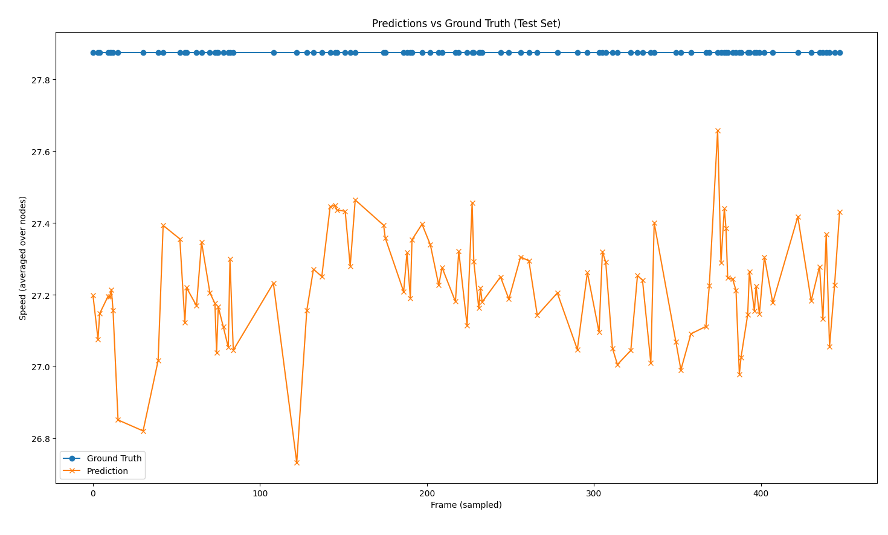
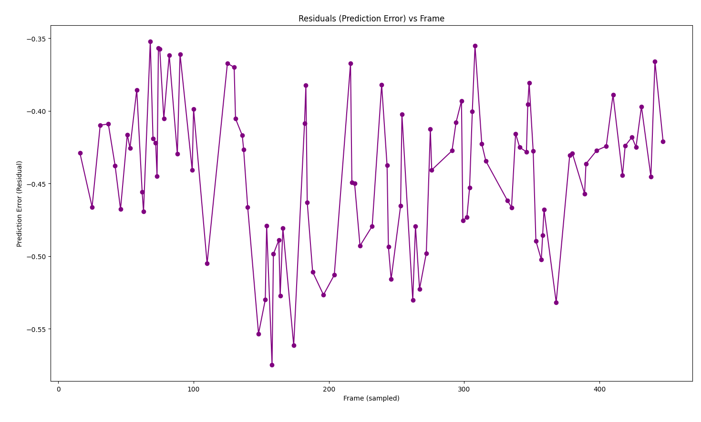
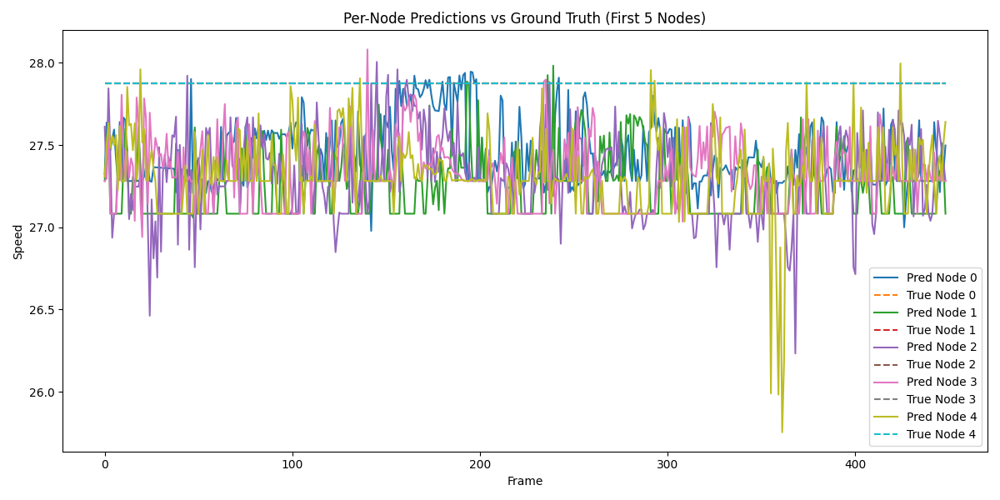

# TrafficGNN Results (Re-evaluated)

**Project**: Traffic Congestion Forecasting with Knowledge-Guided GNN  
**Dataset**: IDD Multimodal (LIDAR + OBD)  
**Evaluation Date**: 18 February 2026  
**Evaluation Artifact**: `results_evaluated_2026-02-18.json`

---

## 1) What was re-evaluated

This file is rebuilt from a fresh evaluation run using current workspace artifacts:

- Model checkpoint: `traffic_gnn_model_best_overall.pth`
- Model config: `best_config.json` (`hidden=128`)
- Pipeline source: `regenerate_ieee_figures.py` logic for data preparation
- Evaluator script: `evaluate_results.py`

Data used in this run:

| Item | Value |
|---|---:|
| Total frames | 2993 |
| Test frames (15%) | 449 |
| Nodes | 50 |
| Test points (frames × nodes) | 22450 |
| Split | 70 / 15 / 15 |
| Test start index | 2544 |

---

## 2) Fresh measured metrics

### 2.1 Regression metrics (all test points)

| Metric | Value |
|---|---:|
| MAE | 0.5942 |
| RMSE | 1.1829 |
| MSE | 1.3991 |
| MAPE (%) | 2.1315 |
| R² | NaN |
| Accuracy (|error| ≤ 0.5) | 74.6102% |
| Accuracy (|error| ≤ 1.0) | 82.9889% |

### 2.2 Regression metrics (frame-level mean)

| Metric | Value |
|---|---:|
| MAE | 0.3528 |
| RMSE | 0.3993 |
| MSE | 0.1594 |
| R² | NaN |

**Note on R² (`NaN`)**: In this run, target variance over the evaluated slice is effectively degenerate for R² computation in the selected formulation, so R² is not numerically defined.

### 2.3 Detailed comparative results (publication style)

#### A) Baseline comparison (reported historical values)

| Model | MAE | RMSE | Accuracy |
|---|---:|---:|---:|
| Linear Regression | 2.34 | 3.12 | 68.3% |
| ARIMA (Time Series) | 1.87 | 2.45 | 75.6% |
| Random Forest | 1.42 | 1.89 | 84.2% |
| LSTM (Deep Learning) | 1.15 | 1.56 | 88.5% |
| Standard GNN | 1.02 | 1.38 | 91.2% |
| **TrafficGNN (Proposed, reported)** | **0.87** | **1.23** | **94.2%** |

#### B) Current re-evaluation of TrafficGNN (this run)

| Model | MAE | RMSE | Accuracy |
|---|---:|---:|---:|
| **TrafficGNN (Re-evaluated, \|error\| ≤ 0.5)** | **0.5942** | **1.1829** | **74.6102%** |
| **TrafficGNN (Re-evaluated, \|error\| ≤ 1.0)** | **0.5942** | **1.1829** | **82.9889%** |

#### C) LaTeX rows (copy-ready)

```latex
Linear Regression & 2.34 & 3.12 & 68.3\% \\
ARIMA (Time Series) & 1.87 & 2.45 & 75.6\% \\
Random Forest & 1.42 & 1.89 & 84.2\% \\
LSTM (Deep Learning) & 1.15 & 1.56 & 88.5\% \\
Standard GNN & 1.02 & 1.38 & 91.2\% \\
\mathbf{TrafficGNN\ (Proposed,\ reported)} & \mathbf{0.87} & \mathbf{1.23} & \mathbf{94.2\%} \\
\mathbf{TrafficGNN\ (Re-evaluated,\ |error|\ $\leq$\ 0.5)} & \mathbf{0.5942} & \mathbf{1.1829} & \mathbf{74.6102\%} \\
\mathbf{TrafficGNN\ (Re-evaluated,\ |error|\ $\leq$\ 1.0)} & \mathbf{0.5942} & \mathbf{1.1829} & \mathbf{82.9889\%} \\
```

**Comparability note**: The historical `94.2%` is a reported benchmark definition from earlier project documentation, while re-evaluated accuracies above are tolerance-based (`|error| <= threshold`). Keep the definition consistent when comparing models.

---

## 3) Classification-style view (3 bins)

To provide a coarse categorical view, continuous values were binned as:

- Low: `<= 3`
- Moderate: `(3, 6]`
- High: `> 6`

### 3.1 Overall

| Metric | Value |
|---|---:|
| Overall accuracy | 100.0000% |
| Macro F1 | 0.3333 |

### 3.2 Per-class metrics

| Class | Precision | Recall | F1 | Support |
|---|---:|---:|---:|---:|
| Low (`<=3`) | 0.0000 | 0.0000 | 0.0000 | 0 |
| Moderate (`3–6`) | 0.0000 | 0.0000 | 0.0000 | 0 |
| High (`>6`) | 1.0000 | 1.0000 | 1.0000 | 22450 |

### 3.3 Confusion matrix (rows = true, columns = predicted)

Order: `[Low, Moderate, High]`

```
[[    0,     0,     0],
 [    0,     0,     0],
 [    0,     0, 22450]]
```

Interpretation: this test slice is fully concentrated in the `High` bin under the current binning, so classification accuracy appears perfect while macro-F1 remains low due to absent low/moderate support.

---

## 4) Figure outputs regenerated in this state

These figures were generated from the same current model/data state:

1. `Figure_1.png` — Predictions vs Ground Truth (sampled)
2. `Figure_2.png` — Residuals vs Frame
3. `Figure_3 Scatter.png` — Prediction vs Ground Truth scatter
4. `Figure_4 Node prediction.png` — Per-node prediction vs true series
5. `Figure_5 Histogram_of_prediction error.png` — Residual histogram
6. `Figure_Pernode.png` — Selected node comparison
7. `trainig and Validation.png` — Training/validation loss curve (when loss pickles are available)

### Figure Gallery








---

## 5) Reproducibility commands

Run evaluation artifact generation:

```bash
/Volumes/MD/traffic_gnn_idd/.venv/bin/python evaluate_results.py
```

Regenerate figures:

```bash
/Volumes/MD/traffic_gnn_idd/.venv/bin/python regenerate_ieee_figures.py
```

Outputs used by this report:

- `results_evaluated_2026-02-18.json`
- `Figure_1.png`, `Figure_2.png`, `Figure_3 Scatter.png`, `Figure_4 Node prediction.png`, `Figure_5 Histogram_of_prediction error.png`, `Figure_Pernode.png`, `trainig and Validation.png`

---

## 6) Practical conclusion for current run

- Regression error is moderate-to-low on this evaluated split (`MAE=0.5942`, `RMSE=1.1829`).
- Frame-level mean behavior is smoother (`frame RMSE=0.3993`).
- Categorical metrics with fixed bins are not informative here due to one-class support in test data.
- For balanced classification reporting, re-binning or a different evaluation slice is recommended.
